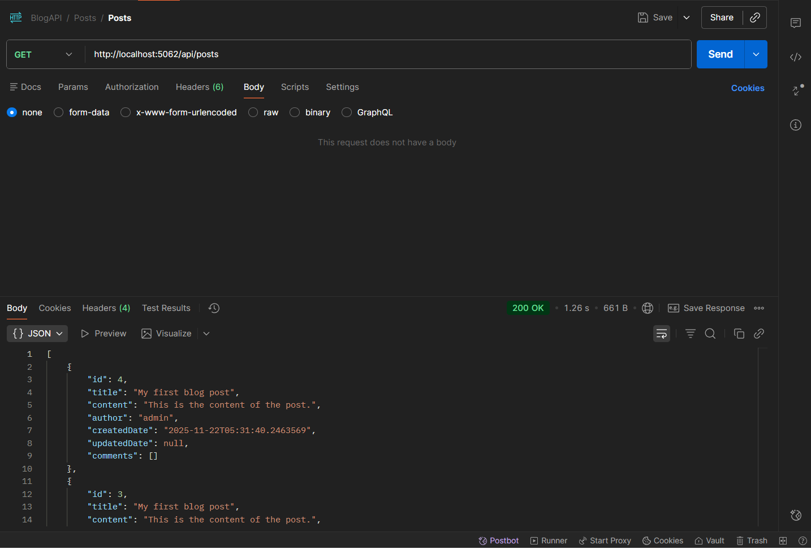
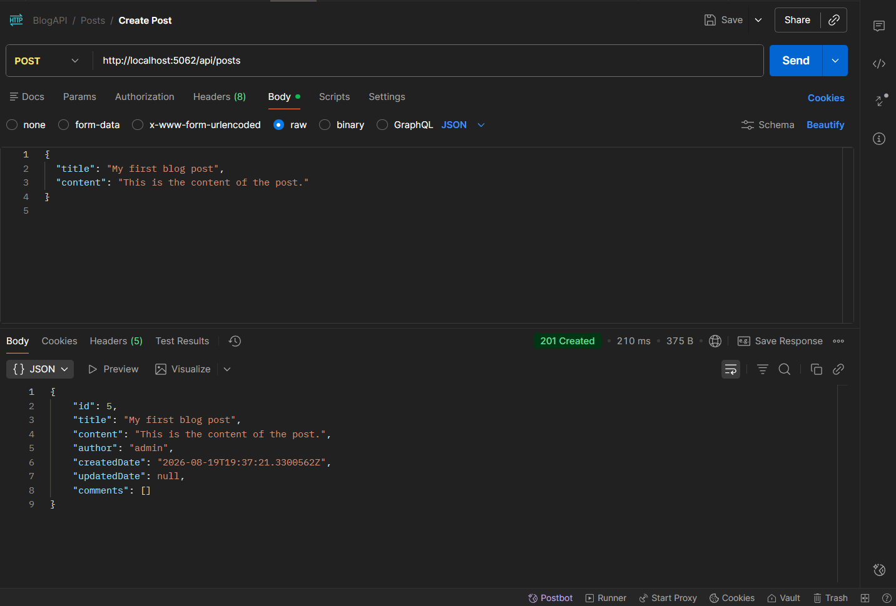

# Blog API Platform

A RESTful blog API built with ASP.NET Core, Entity Framework Core, and SQLite.  
The project supports blog post and comment management through structured API endpoints and follows a layered architecture with separate API, Core, and Infrastructure projects.

## Overview

This project was built to practice backend API development using C# and ASP.NET Core. It demonstrates how to design REST endpoints, separate application layers, use repository interfaces, and persist data using Entity Framework Core with SQLite.

## Tech Stack

- **Language:** C#
- **Framework:** ASP.NET Core
- **ORM:** Entity Framework Core
- **Database:** SQLite
- **Architecture:** Layered architecture
- **Tools:** Git, GitHub, Postman, Visual Studio / VS Code

## Features

- Create, read, update, partially update, and delete blog posts
- Create, read, update, partially update, and delete comments
- Retrieve comments for a specific blog post
- Uses DTOs for partial update requests
- Uses repository interfaces to separate business logic from data access
- Uses SQLite for local database persistence

## Project Structure

```text
BlogAPI/
├── Blog.API/              # API layer with controllers and DTOs
├── Blog.Core/             # Core models and repository interfaces
├── Blog.Infrastructure/   # EF Core database context, migrations, and repositories
└── BlogAPI.sln            # Solution file
```

## API Endpoints

### Posts

| Method | Endpoint | Description |
|---|---|---|
| GET | `/api/posts` | Get all blog posts |
| GET | `/api/posts/{id}` | Get a single blog post by ID |
| POST | `/api/posts` | Create a new blog post |
| PUT | `/api/posts/{id}` | Update an existing blog post |
| PATCH | `/api/posts/{id}` | Partially update a blog post |
| DELETE | `/api/posts/{id}` | Delete a blog post |

### Comments

| Method | Endpoint | Description |
|---|---|---|
| GET | `/api/comments` | Get all comments |
| GET | `/api/comments/{id}` | Get a single comment by ID |
| GET | `/api/posts/{postId}/comments` | Get comments for a specific post |
| POST | `/api/posts/{postId}/comments` | Create a comment for a post |
| PUT | `/api/comments/{id}` | Update an existing comment |
| PATCH | `/api/comments/{id}` | Partially update a comment |
| DELETE | `/api/comments/{id}` | Delete a comment |

## Example Requests

### Create Post

```json
{
  "title": "My First Blog Post",
  "content": "This is the content of the blog post."
}
```

### Create Comment

```json
{
  "name": "Michael",
  "email": "michael@example.com",
  "content": "This is a sample comment."
}
```

## Screenshots

### Get Blog Posts



### Create Blog Post



## Getting Started

### Prerequisites

- .NET SDK
- SQLite
- Visual Studio, VS Code, or another C# IDE
- Postman or another API testing tool

### Run Locally

Clone the repository:

```bash
git clone https://github.com/MichaelLauSheridan/BlogAPI.git
cd BlogAPI
```

Restore dependencies:

```bash
dotnet restore
```

Run the API project:

```bash
dotnet run --project Blog.API
```
By default, the development environment uses a local SQLite database file named `blog.sqlite`.

The API can then be tested using Postman or another API client.

## What I Learned

Through this project, I practiced:

- Building RESTful APIs with ASP.NET Core
- Structuring a backend project using layered architecture
- Using Entity Framework Core with SQLite
- Creating repository interfaces and implementations
- Working with DTOs for partial updates
- Testing API endpoints with Postman
- Organizing backend code for maintainability

## Future Improvements

- Add authentication and authorization
- Add input validation improvements
- Add automated unit and integration tests
- Add Swagger/OpenAPI documentation
- Add pagination for posts and comments
- Add deployment instructions
